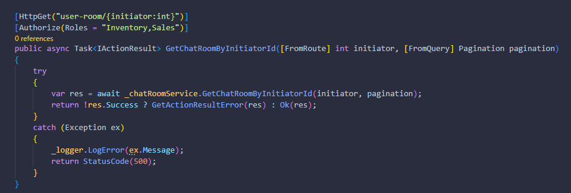
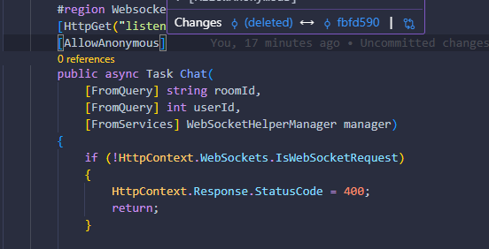
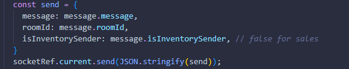

# Chat Functionality
Account with messages and room data with ``Sales`` Role
- TestUser
- password123

## Scenario
1. After ``sales`` user's first message, it will create a room and inventory will automatically see the new message/room.
2. If u using ``sales-chat`` for demo just refresh if first timer, cuz im still looking into it.
3. ``Websocket communication should work`` No changes will be made on this endpoint or add if any.

 

# Guide
- For pagination in inventory, it will trigger a fetch once viewport is true (scrolling-up). Just set ``pagesize`` to any amount if you don't want to apply pagination.
- See ``sales-chat`` for sales user demo, hope makagets dont have time to clean it.

 

## This is the only Endpoint for Sales ``/v1/chat/user-room/{userId}`` this gets user's room and chat history and returns ``ChatRoomDto``

 

## For Websocket endpoint.. see ``sales-chat/src/components/chat-room/index.tsx`` for example.

 

## How sales sends/receives data thru socket.

## Lacking rn (for inventory)
- Real-time user message (that are not connected from WS)
- Unread/read real-time and update.
- New connection + Closed previous connection when switching users.
- Bug when close and open room popover.